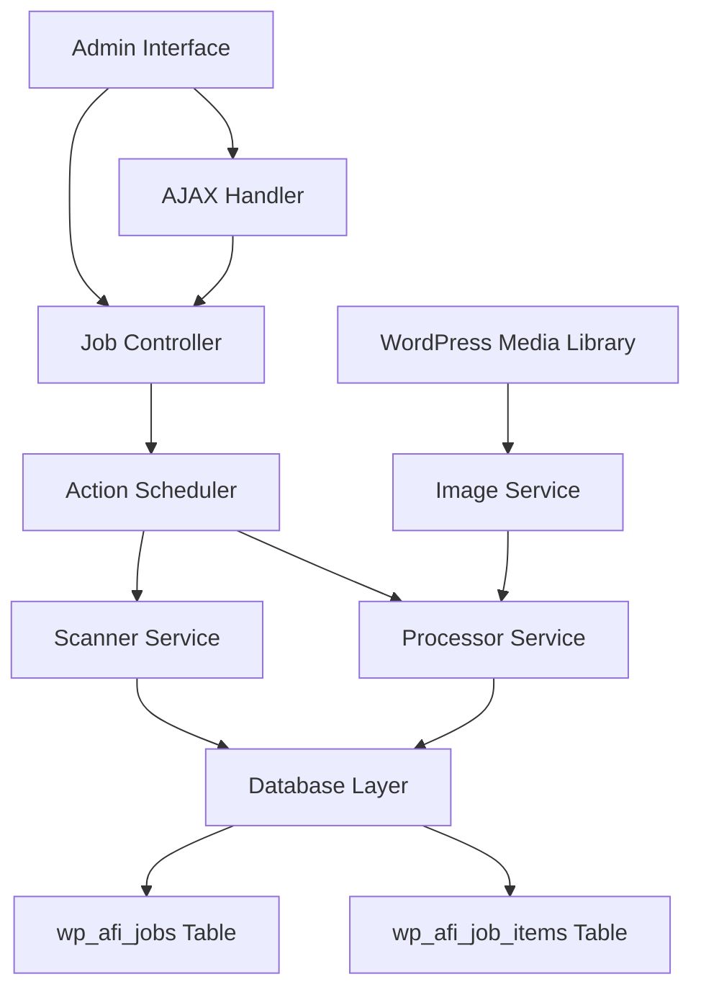

# Design Document

## Overview

The Auto Featured Image plugin is architected as a high-performance, scalable WordPress solution that leverages asynchronous job processing to handle large datasets efficiently. The design follows a decoupled architecture where the user interface, job management, and processing logic are separated into distinct components that communicate through a well-defined API.

The core architecture revolves around the Action Scheduler library for reliable background processing, custom database tables for scalable data storage, and a responsive AJAX-driven admin interface that provides real-time monitoring without blocking the user experience.

## Architecture

### High-Level Architecture Diagram



### Core Architectural Principles

1. **Separation of Concerns**: Each component has a single responsibility
2. **Asynchronous Processing**: All heavy operations run in background queues
3. **Scalable Data Storage**: Custom tables optimized for large datasets
4. **Responsive UI**: Non-blocking interface with real-time updates
5. **Fault Tolerance**: Graceful error handling and recovery mechanisms

## Components and Interfaces

### 1. Plugin Bootstrap (`auto-featured-image.php`)

**Responsibility**: Plugin initialization, dependency loading, and WordPress hooks registration.

```php
class AFI_Plugin {
    private $version = '1.0.0';
    private $loader;
    private $admin;
    private $job_manager;
    
    public function __construct() {
        $this->load_dependencies();
        $this->define_admin_hooks();
        $this->define_public_hooks();
    }
    
    public function run() {
        $this->loader->run();
    }
}
```

### 2. Database Manager (`includes/class-afi-database.php`)

**Responsibility**: Database schema creation, table management, and data access layer.

```php
class AFI_Database {
    public function create_tables();
    public function drop_tables();
    public function get_job($job_id);
    public function create_job($data);
    public function update_job($job_id, $data);
    public function get_job_items($job_id, $limit, $offset);
    public function create_job_item($data);
    public function update_job_item($item_id, $data);
}
```

**Database Schema**:

```sql
-- wp_afi_jobs table
CREATE TABLE wp_afi_jobs (
    id bigint(20) unsigned NOT NULL AUTO_INCREMENT,
    status varchar(20) NOT NULL DEFAULT 'pending',
    post_types longtext NOT NULL,
    image_filters longtext,
    total_items bigint(20) unsigned DEFAULT 0,
    processed_items bigint(20) unsigned DEFAULT 0,
    created_at datetime NOT NULL,
    finished_at datetime DEFAULT NULL,
    PRIMARY KEY (id),
    KEY status (status),
    KEY created_at (created_at)
);

-- wp_afi_job_items table
CREATE TABLE wp_afi_job_items (
    id bigint(20) unsigned NOT NULL AUTO_INCREMENT,
    job_id bigint(20) unsigned NOT NULL,
    post_id bigint(20) unsigned NOT NULL,
    status varchar(20) NOT NULL DEFAULT 'pending',
    assigned_image_id bigint(20) unsigned DEFAULT NULL,
    log_message text,
    processed_at datetime DEFAULT NULL,
    PRIMARY KEY (id),
    KEY job_id (job_id),
    KEY post_id (post_id),
    KEY status (status),
    FOREIGN KEY (job_id) REFERENCES wp_afi_jobs(id) ON DELETE CASCADE
);
```

### 3. Job Manager (`includes/class-afi-job-manager.php`)

**Responsibility**: Job lifecycle management, Action Scheduler integration, and job state coordination.

```php
class AFI_Job_Manager {
    public function create_scan_job($post_types, $image_filters);
    public function start_scan($job_id);
    public function start_processing($job_id);
    public function pause_job($job_id);
    public function resume_job($job_id);
    public function cancel_job($job_id);
    public function get_job_status($job_id);
    public function cleanup_old_jobs($days);
}
```

### 4. Scanner Service (`includes/class-afi-scanner.php`)

**Responsibility**: Efficient post scanning with batch processing and progress tracking.

```php
class AFI_Scanner {
    private $batch_size = 1000;
    
    public function scan_posts_batch($job_id, $post_types, $page);
    public function count_posts_without_featured_image($post_types);
    public function is_scan_complete($job_id);
    private function has_featured_image($post_id);
}
```

**Scanning Algorithm**:
1. Query posts in batches using WP_Query with pagination
2. Check each post for `_thumbnail_id` meta key
3. Record posts without featured images in `wp_afi_job_items`
4. Schedule next batch or mark scan complete
5. Update job progress in real-time

### 5. Processor Service (`includes/class-afi-processor.php`)

**Responsibility**: Image assignment processing with optimized random selection.

```php
class AFI_Processor {
    public function process_job_item($item_id);
    public function assign_random_image($post_id, $image_filters);
    private function get_random_image_efficient($filters);
    private function get_image_count($filters);
    private function get_image_batch($filters, $count);
}
```

**Image Selection Algorithm**:
1. **Count Method**: Get total filtered image count, generate random offset
2. **Batch Method**: Pre-fetch 50-100 random image IDs, use from memory
3. **Fallback**: Direct query with LIMIT 1 OFFSET for single selections

### 6. Image Service (`includes/class-afi-image-service.php`)

**Responsibility**: Media library interaction and image filtering logic.

```php
class AFI_Image_Service {
    public function get_filtered_images($filters);
    public function apply_date_filter($query, $start_date, $end_date);
    public function apply_keyword_filter($query, $keyword);
    public function cache_image_count($filters);
    public function get_cached_image_count($filters);
}
```

### 7. Admin Controller (`admin/class-afi-admin.php`)

**Responsibility**: Admin interface rendering, form handling, and AJAX endpoint management.

```php
class AFI_Admin {
    public function enqueue_styles();
    public function enqueue_scripts();
    public function add_admin_menu();
    public function display_admin_page();
    public function handle_ajax_requests();
    public function handle_job_creation();
    public function handle_job_control();
}
```

### 8. AJAX Handler (`admin/class-afi-ajax.php`)

**Responsibility**: Real-time communication between frontend and backend.

```php
class AFI_Ajax {
    public function get_job_progress();
    public function get_job_logs();
    public function control_job();
    public function get_scan_results();
    public function validate_nonce($action);
}
```

## Data Models

### Job Model
```php
class AFI_Job_Model {
    public $id;
    public $status; // 'scanning', 'pending', 'running', 'paused', 'complete', 'canceled'
    public $post_types; // JSON array
    public $image_filters; // JSON object
    public $total_items;
    public $processed_items;
    public $created_at;
    public $finished_at;
    
    public function get_progress_percentage();
    public function is_active();
    public function can_be_paused();
}
```

### Job Item Model
```php
class AFI_Job_Item_Model {
    public $id;
    public $job_id;
    public $post_id;
    public $status; // 'pending', 'complete', 'failed'
    public $assigned_image_id;
    public $log_message;
    public $processed_at;
    
    public function mark_complete($image_id);
    public function mark_failed($error_message);
}
```

### Image Filter Model
```php
class AFI_Image_Filter_Model {
    public $use_all_images = true;
    public $date_range = null; // ['start' => date, 'end' => date]
    public $keyword = null;
    public $keyword_fields = ['filename', 'title', 'alt']; // searchable fields
    
    public function to_wp_query_args();
    public function get_cache_key();
}
```

## Error Handling

### Error Categories and Strategies

1. **Database Errors**
   - Connection failures: Retry with exponential backoff
   - Query failures: Log error, skip item, continue processing
   - Table creation failures: Display admin notice, prevent activation

2. **Processing Errors**
   - Image assignment failures: Log error, mark item as failed
   - Post update failures: Retry once, then mark as failed
   - Memory exhaustion: Reduce batch sizes dynamically

3. **User Interface Errors**
   - AJAX failures: Display user-friendly error messages
   - Form validation errors: Highlight fields, show specific messages
   - Permission errors: Redirect to appropriate page with notice

### Error Recovery Mechanisms

```php
class AFI_Error_Handler {
    public function handle_database_error($error, $context);
    public function handle_processing_error($error, $item_id);
    public function handle_ajax_error($error, $action);
    public function log_error($error, $context, $severity);
    public function should_retry($error_type, $attempt_count);
}
```

## Testing Strategy

### Unit Testing Approach

1. **Database Layer Testing**
   - Test table creation and schema validation
   - Test CRUD operations for jobs and job items
   - Test query performance with large datasets
   - Mock WordPress database functions

2. **Service Layer Testing**
   - Test scanner batch processing logic
   - Test image selection algorithms
   - Test job state transitions
   - Mock external dependencies

3. **Integration Testing**
   - Test Action Scheduler integration
   - Test WordPress hooks and filters
   - Test admin interface workflows
   - Test AJAX communication

### Performance Testing

1. **Load Testing**
   - Test with 100K+ posts and images
   - Measure memory usage during batch processing
   - Test concurrent job execution
   - Monitor database query performance

2. **Stress Testing**
   - Test system behavior under high load
   - Test error recovery mechanisms
   - Test data cleanup operations
   - Monitor server resource usage

### Testing Tools and Framework

```php
// PHPUnit test structure
class AFI_Scanner_Test extends WP_UnitTestCase {
    public function test_batch_scanning_with_large_dataset();
    public function test_memory_usage_during_scan();
    public function test_scan_progress_tracking();
    public function test_error_handling_during_scan();
}

class AFI_Processor_Test extends WP_UnitTestCase {
    public function test_random_image_selection_performance();
    public function test_image_assignment_accuracy();
    public function test_batch_processing_efficiency();
    public function test_error_recovery_mechanisms();
}
```

### Manual Testing Scenarios

1. **Large Dataset Scenarios**
   - Test with 1M+ posts and 100K+ images
   - Test job pause/resume functionality
   - Test system behavior during server restarts
   - Test data cleanup and retention policies

2. **Edge Cases**
   - Test with no available images
   - Test with posts that already have featured images
   - Test with corrupted job data
   - Test with insufficient server resources

3. **User Experience Testing**
   - Test admin interface responsiveness
   - Test real-time progress updates
   - Test error message clarity
   - Test job management workflows